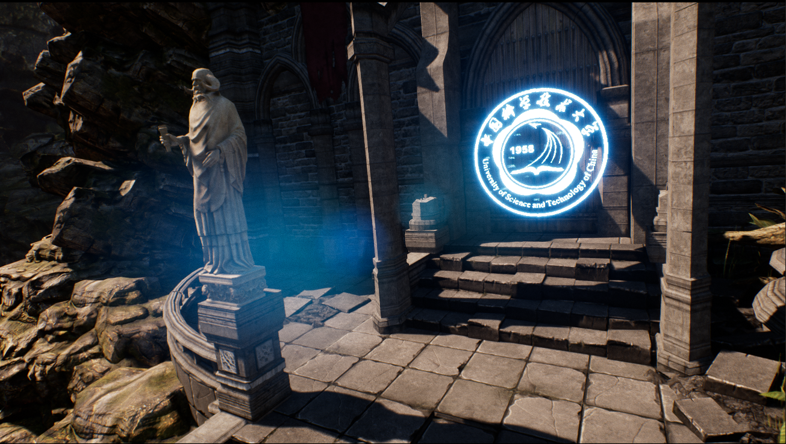

# 项目名称：Battle of Castle Ruins

### 项目简介：

本游戏是使用虚幻4引擎制作的动作角色扮演类游戏(ARPG)。中国科学技术大学的上学路上异常险恶，为了顺利到达学校，你必须打败一路上凶悍无比的野兽和敌人们。你可以选择使用战士或是法师，来与这些阻碍你前进的生物战斗。

### 游戏说明：

选择人物: 选战士按N，选法师按M，按回车确认。游戏中按P暂停。

本游戏支持鼠标键盘和手柄操控人物

鼠标键盘：鼠标控制视角，WASD来操控前后左右行走，按空格跳跃，按住shift键并移动来奔跑，按alt躲闪。

手柄：RS控制视角，LS来操控上下左右行走，按Y跳跃，按住A来奔跑，按B躲闪

除了行走和跳跃以外，所有的行动都会消耗精力

本游戏中的两个职业有着不同的技能

**战士** ：轻击、重击

鼠标键盘：鼠标左键轻击，鼠标右键重击

手柄：RB轻击，RT重击

**法师** ：寒冰箭、火球术、法力护盾、潜行术

鼠标键盘：鼠标左键按住发射寒冰箭(共三阶段，松开左键中止)，按下鼠标右键火球术、按住Q激活魔法护盾、按住E激活隐身、按住TAB键自由移动视野、鼠标滚轮控制视野远近

手柄：按住RB寒冰箭，按下RT火球术，按住LB激活魔法护盾，按住LT激活隐身

游戏BGM：knight artorias

通关BGM：永恒的东风

### 相关链接

- [Trailer](https://github.com/IridiumStudio/CGProject/releases/download/v1.1/Way2USTC_Trailer.mp4)

- [游戏下载](https://github.com/IridiumStudio/CGProject/releases)
- [优酷在线播放](http://v.youku.com/v_show/id_XMjc3Nzc2MDYyMA==.html)
- [课程主页](http://staff.ustc.edu.cn/~lgliu/Courses/ComputerGraphics_2017_spring-summer/default.htm)

